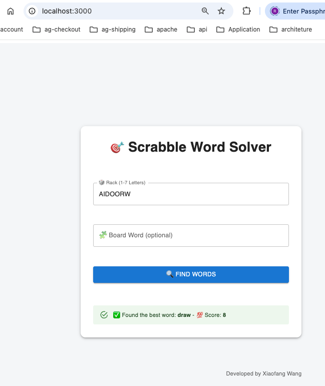
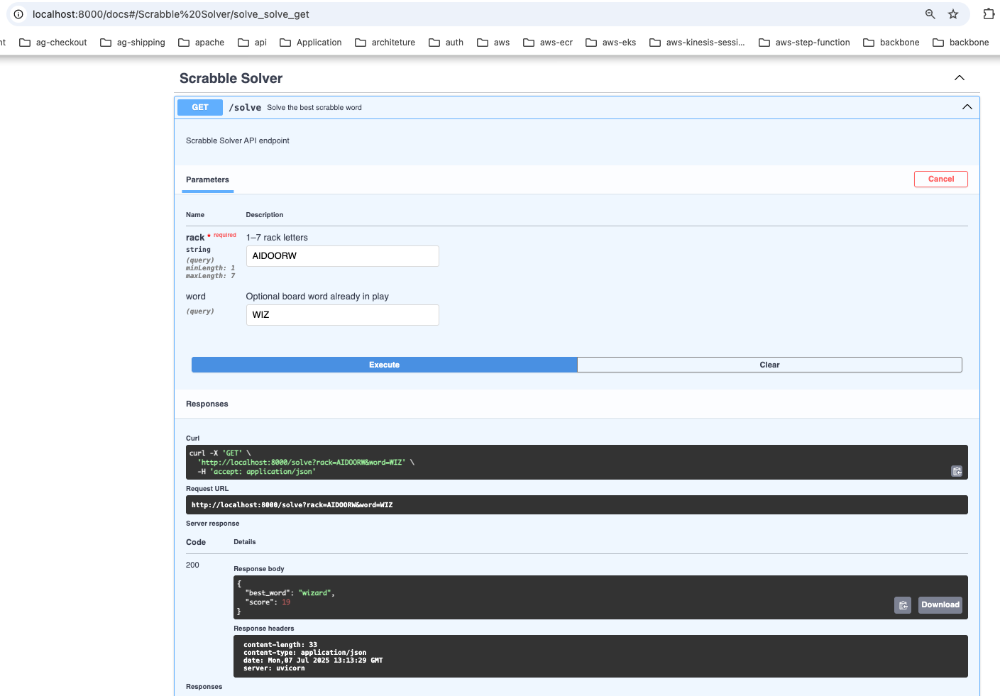

# 🧠 Scrabble Word Solver

A full-stack Scrabble word solver built with:

- **FastAPI (Python)** for the backend
- **React + Vite + Material UI** for the frontend
- **Docker** for local development

---

### 📁 Project Structure

```
scrabble-word-solver/
├── api/                    # Backend - FastAPI application
├── ui/                     # Frontend - React (Vite + Material UI)
├── .gitignore              # Git ignored files
├── demo.mp4                # Optional demo video (usage preview)
├── docker-compose.yml      # Docker Compose setup for full-stack
└── README.md               # Project overview and usage
```

---

## 📚 Detailed Component Docs

- 🔧 [Backend (FastAPI)](api/README.md)
- 🎨 [Frontend (React + Vite + MUI)](ui/README.md)

---

### 🧰 Prerequisites

Install [Docker Desktop](https://www.docker.com/products/docker-desktop) for:

- **Mac**
- **Windows**

Verify installation:

```bash
docker --version
docker compose version
```

Clone the repo

```
git clone https://github.com/xiaofanggit/scrabble-word-solve.git
cd scrabble-word-solver
```

Build the container

```
docker compose build
```

### ▶️ Start the app

```
docker compose up
```

Open in browser

Frontend: http://localhost:3000



Backend Swagger API: http://localhost:8000/docs


---
